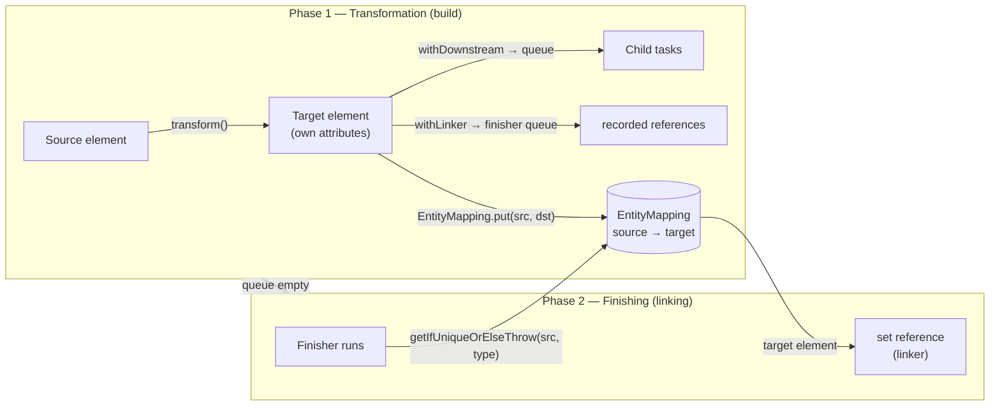
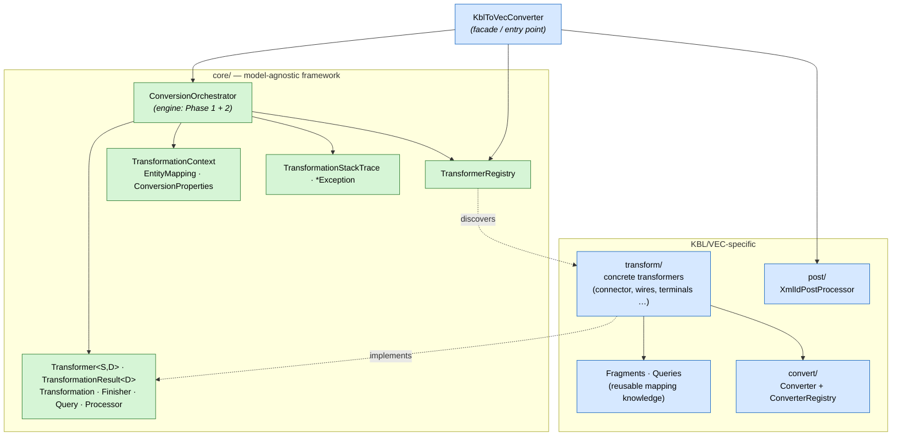
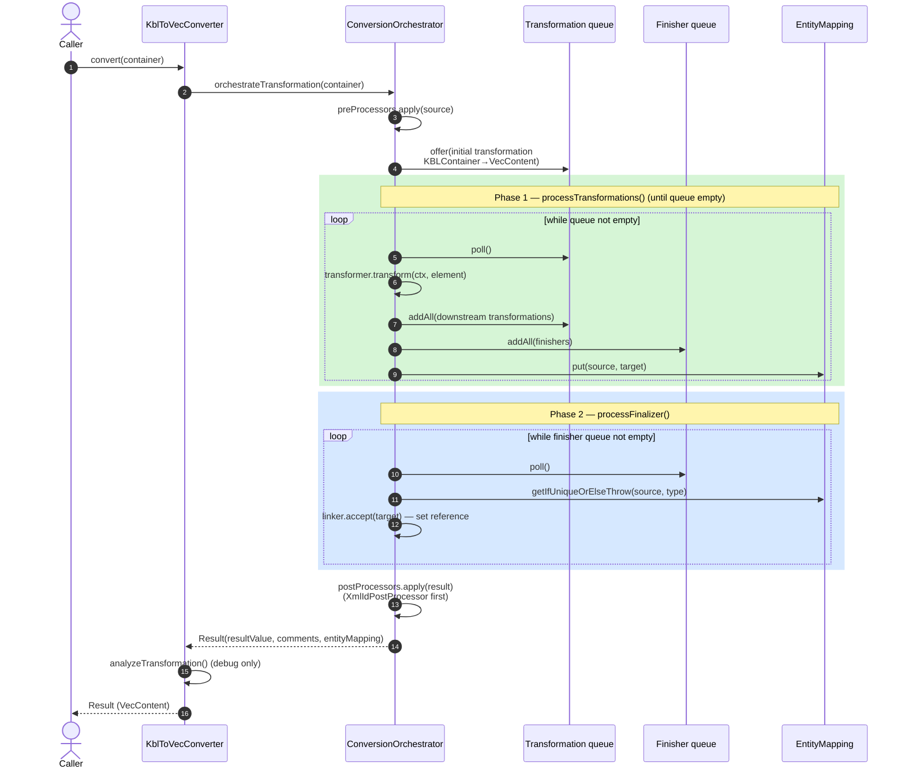
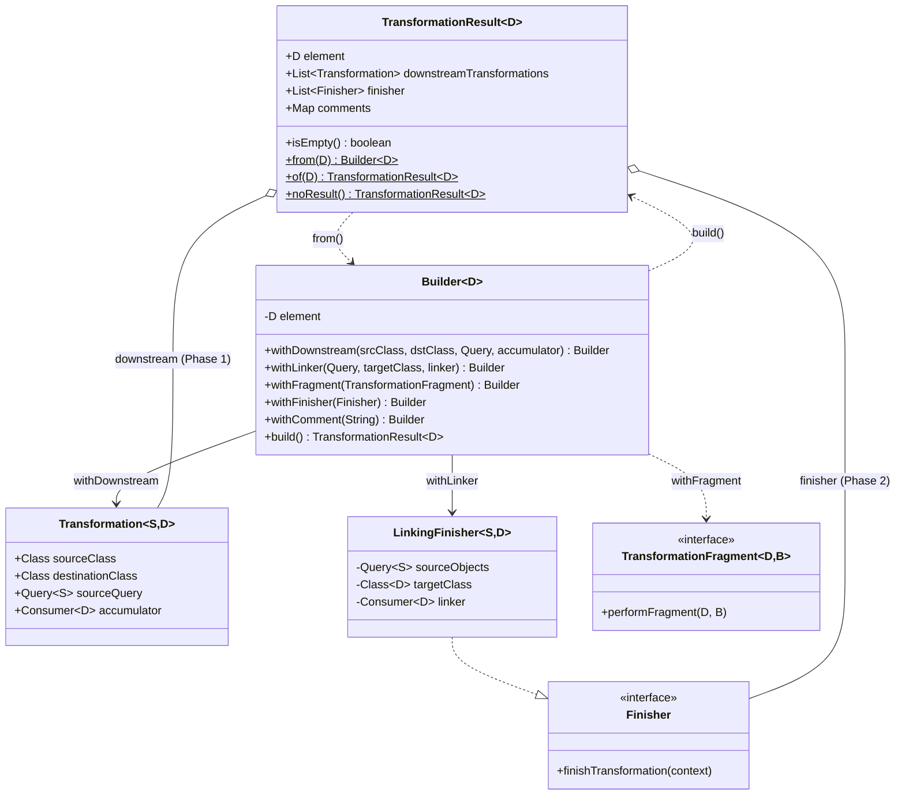
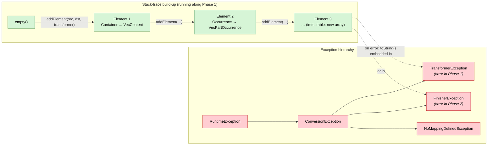
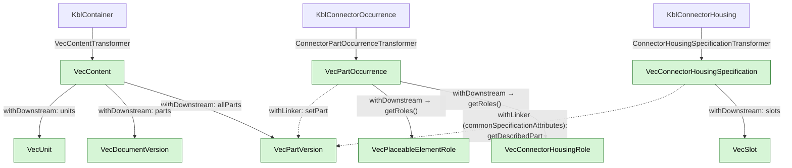
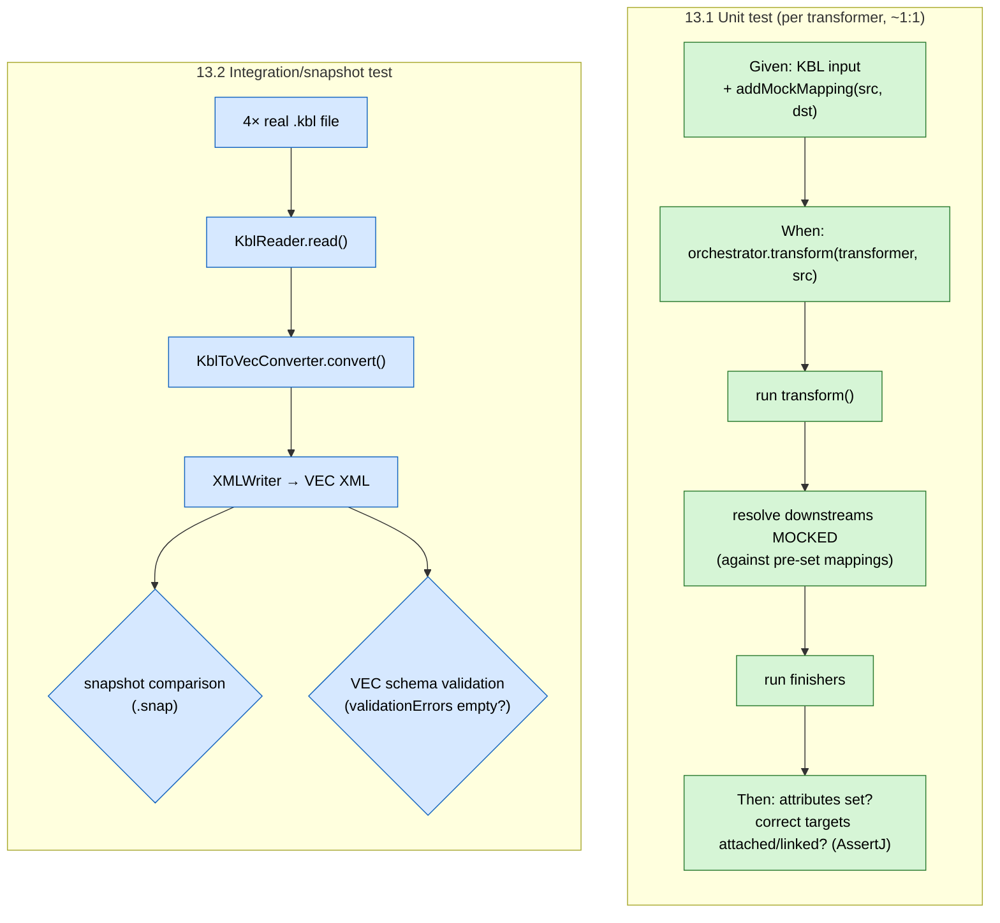

# kbl2vec — Architecture Analysis (Two-Phase Conversion)

> Analysis document describing the architecture of the `kbl2vec` module, intended as a reference for designing
> similar two-phase model-to-model converters.
> Status: analysis of the `kbl2vec` module (branch `develop`).
> This document describes **only** how `kbl2vec` works today. It contains no implementation.

---

## 1. Overview & Core Idea

`kbl2vec` converts a KBL model (`KBLContainer`, kbl-v25) into a VEC model (`VecContent`, vec-v2x).
The central problem of any model-to-model conversion: **cross-references**. A source element B references
source element A; in the target, B' must point to A'. As long as A' does not yet exist, B' cannot be linked.

The solution is a **two-phase conversion**:

- **Phase 1 — Transformation (build):** Every source element is translated into its target element(s).
  Only the element's *own* attributes are set, and the source→target mapping is registered in a central map
  (`EntityMapping`). References to other elements are **not** resolved immediately, but are recorded as *finishers*
  (deferred linking tasks). Phase 1 also discovers the next elements to be transformed dynamically
  (*downstream transformations*).
- **Phase 2 — Finishing (linking):** Once all elements exist and are registered in `EntityMapping`, all recorded
  finishers run. They look up source element → target element in the map and set the references.

The entire process is **data-driven and self-expanding**: there is no central "mapping list" that knows all
elements. Instead, each transformer declares which *dependent* elements should be transformed next. Starting from a
single root element (`KBLContainer`), the whole graph is spanned (a kind of breadth-first traversal over a work queue).

The following diagram shows both phases at a glance — Phase 1 builds the target elements and fills the
`EntityMapping`, Phase 2 uses that mapping to set the cross-references:



> **Key idea:** `withDownstream` = "create this element" (Phase 1). `withLinker` = "reference it later"
> (Phase 2). Only once *all* elements have been created and registered in `EntityMapping` during Phase 1 can the
> references be resolved reliably in Phase 2.

---

## 2. Layers & Packages

```
com.foursoft.harness.kbl2vec
├── KblToVecConverter                 ← public entry point (facade)
├── ReflectionsBasedTransformerRegistry ← discovers transformers via classpath scan
├── core/                             ← the reusable framework (model-agnostic)
│   ├── ConversionOrchestrator        ← the engine (Phase 1 & Phase 2 loops)
│   ├── Transformer<S,D>              ← SPI: a single element-type mapping (Phase 1)
│   ├── TransformationResult<D>       ← return value of a transformer (+ Builder)
│   ├── Transformation<S,D>           ← a recorded downstream task
│   ├── Finisher / LinkingFinisher    ← Phase 2 linking task
│   ├── Query<T>                      ← supplier of source elements (lazy)
│   ├── TransformationContext(+Impl)  ← shared state (mapping, properties, converters, IDs, logger)
│   ├── EntityMapping                 ← source→target multimap + unique resolution
│   ├── ConversionProperties          ← default values / configuration
│   ├── Processor<D>                  ← pre-/post-processor SPI
│   ├── TransformationStackTrace(+Element) ← provenance / error tracking
│   └── *Exception                    ← Conversion/Transformer/Finisher/NoMapping
├── convert/                          ← converters (simple, non-referenceable value conversions)
│   ├── Converter<S,D>                ← SPI
│   ├── ConverterRegistry             ← holds the converter instances
│   └── StringToColor/Material/WireType/LocalizedString, DoublesToCartesianVector2D/3D
├── transform/                        ← the concrete transformers (the actual mapping knowledge)
│   ├── Fragments / Queries           ← reusable building blocks (see below)
│   ├── core/                         ← VecContentTransformer (root), Unit, ValueRange, CustomProperty …
│   ├── components/…                  ← grouped by domain: connector, wires, terminals, ee_components,
│   │                                   accessory, fixing, seals, plugs, protection, copack, assembly, common …
│   ├── contacting/, geometry/, modules/, topology/
└── post/                             ← XmlIdPostProcessor (post-processor)
```

**Important for the rewrite:** The `core` package is fully **model-agnostic** (no KBL/VEC imports except through
generics). It is the actual "two-phase framework" and immediately reusable. Only `transform/`, `convert/`, `post/`,
`KblToVecConverter`, and the `Queries`/`Fragments` helpers contain KBL/VEC-specific knowledge.

The following layered view makes the boundary between the reusable framework and the model-specific knowledge visible
(green = generic/reusable, blue = KBL/VEC-specific):



---

## 3. The Data Flow (Sequence)

`KblToVecConverter.convert(container)`:

1. **Create the orchestrator** — root types (`KBLContainer` → `VecContent`), `TransformerRegistry`,
   `ConversionProperties`. The internal `XmlIdPostProcessor` is registered, followed by the user-supplied
   pre-/post-processors.
2. **`orchestrateTransformation(source)`**:
   1. **Pre-processing**: the source runs through all `preProcessors` (pipeline).
   2. **Initial transformation**: a `Transformation<KBLContainer, VecContent>` with the accumulator
      `resultReference::set` is placed in the queue. The accumulator captures the root result.
   3. **Phase 1 — `processTransformations()`**: the work queue is drained until empty (see section 4). Along the way
      it continuously creates new downstream transformations and collects finishers.
   4. **Phase 2 — `processFinalizer()`**: the finisher queue is drained (see section 5).
   5. **Post-processing**: the result runs through all `postProcessors` (first `XmlIdPostProcessor`, then custom).
   6. **Result**: `Result<D>(resultValue, comments, entityMapping)`.
3. **`analyzeTransformation`** (only when debug logging is active): lists unmapped KBL classes and the
   KBL→VEC class mappings that were actually produced.



---

## 4. Phase 1 — Transformation in Detail

Engine: `ConversionOrchestrator`. Data structure: `Queue<TransformationHolder>` (`ConcurrentLinkedQueue`).

```
while ((holder = transformations.poll()) != null) {
    handleSingleTransformation(holder.transformation(), holder.currentStackTrace());
}
```

For each `Transformation<FROM,TO>`:

1. **Transformer lookup**: `transformerRegistry.getTransformer(sourceClass, destinationClass)` returns
   *all* transformers that serve `(FROM, TO)` (there can be several — e.g. multiple roles from one occurrence).
2. **Fetch source elements**: `transformation.sourceQuery().stream()` — the `Query` lazily supplies the inputs
   (0..n elements).
3. For each source element × each matching transformer: `transformer.transform(context, element)` →
   `TransformationResult<TO>`.
4. For each non-empty result (`!result.isEmpty()`, i.e. `element != null`):
   - The **stack trace** is extended by one element (provenance: which transformer, which source/target object).
   - The **downstream transformations** from the result are appended to the queue (wrapped with the stack trace)
     → this expands the graph.
   - The **finishers** from the result are placed in the finisher queue (for Phase 2).
   - **`EntityMapping.put(element, result.element())`** registers the source→target mapping.
   - **Comments** are collected.
5. The produced target element is attached to the correct place in the parent target object via
   `transformation.accumulator()` (e.g. `VecContent::getPartVersions.add(...)`).

**Error handling:** if a transformer throws, the full `TransformationStackTrace` is embedded in a
`TransformerException` — so you can see the path of "who requested this transformation".

### The `Transformer<S,D>` Contract

```java
public interface Transformer<S, D> {
    TransformationResult<D> transform(TransformationContext context, S source);
}
```

Conventions followed by all concrete transformers:

- **Default constructor**: the `ReflectionsBasedTransformerRegistry` instantiates via the no-arg constructor.
  Transformers are stateless; all state comes through the `context`.
- **Type guard / `noResult()`**: if the `source` type does not match (source queries are often typed more broadly,
  e.g. `ConnectionOrOccurrence`), the transformer returns `TransformationResult.noResult()`. An empty result is
  ignored by the orchestrator (no mapping, no downstreams). Example: `ConnectorPartOccurrenceTransformer` only reacts
  to `KblConnectorOccurrence`.
- **Multiple mappings of one source element**: the same source element can be translated by several transformers into
  *different* target types (e.g. one occurrence → `VecConnectorHousingRole` **and** `VecPlaceableElementRole`). This
  is intentional; that is why `EntityMapping` is a **multimap**.

### `TransformationResult<D>` & the Builder (the heart of the DSL)

```java
record TransformationResult<D>(D element,
                               List<Transformation<?,?>> downstreamTransformations,
                               List<Finisher> finisher,
                               Map<Object,String> comments)
```

Almost always created via the fluent `Builder` (`TransformationResult.from(element)…build()`):

| Builder method | Purpose | Phase |
|---|---|---|
| `withDownstream(srcClass, dstClass, Query, BiConsumer<D,TO>)` | transform child elements; attach result to parent via consumer | creates Phase 1 task |
| `withDownstream(srcClass, dstClass, Query, Function<D, List<? super TO>>)` | as above, but the target list is supplied (`element -> element.getXyz()`) | Phase 1 |
| `withLinker(Query<FROM>, targetClass, BiConsumer<D,TO>)` | deferred linking: look up FROM→TO in `EntityMapping` and set reference | creates Phase 2 finisher |
| `withLinker(Query<FROM>, targetClass, Function<D,List<? super TO>>)` | as above, insert into target list | Phase 2 |
| `withLinker(FROM, targetClass, Function…)` | convenience overload for a single source object | Phase 2 |
| `withFragment(TransformationFragment<D, Builder<D>>)` | apply a reusable building block (attributes + further downstreams/linkers) | both |
| `withFinisher(Finisher)` | attach an arbitrary finisher directly | Phase 2 |
| `withComment(String)` / `withCommentOnDetail(Identifiable, String)` | XML comment on the result/detail element | output |

**Core idea — `withDownstream` vs. `withLinker`:**

- `withDownstream` = "this child element does not exist yet, **create** it and attach the result here."
  → new Phase 1 task.
- `withLinker` = "this element is created **elsewhere**; **reference** it later." → Phase 2 finisher.

Exactly this separation solves the cross-reference problem.

The following class diagram shows the DSL and where the builder methods deposit their results — `withDownstream`
creates `Transformation` objects (Phase 1 work items), `withLinker`/`withFinisher` create `Finisher`s
(Phase 2 linking), `withFragment` delegates to a reusable building block:



---

## 5. Phase 2 — Finishing / Linking in Detail

Data structure: `Queue<FinisherHolder>`. After Phase 1:

```
while ((fh = finisher.poll()) != null) {
    fh.finisher().finishTransformation(transformationContext);   // on error → FinisherException(+stack trace)
}
```

Standard implementation `LinkingFinisher<S,D>`:

```java
sourceObjects.stream()
    .map(s -> context.getEntityMapping().getIfUniqueOrElseThrow(s, targetClass))
    .forEach(linker);   // linker sets the reference on the already-created target element
```

That is: at finishing time it is guaranteed that all target elements are present in `EntityMapping`.
`getIfUniqueOrElseThrow` resolves source→target **by type and uniquely**:

- 0 hits → `ConversionException` ("No transformation result found …").
- 1 hit → return it.
- multiple hits of the same target type → attempt an exact class match (`getClass() == destinationClass`);
  if it remains ambiguous → `ConversionException`. Already at `put`, `EntityMapping` warns when a source receives
  multiple targets of the same type (potentially ambiguous later resolution).

---

## 6. The `Query<T>` Concept

```java
@FunctionalInterface interface Query<T> { List<T> execute(); default Stream<T> stream() … }
```

A `Query` is a **lazy supplier** of source elements. It is used both for downstream sources and for linker sources.
Static factories:

- `Query.of(element)` — 0 or 1 element (null-safe → empty list).
- `Query.of(Supplier<T>)` — deferred; resolved only at execution time (important because some relations only become
  stable after Phase 1, and to handle null sources gracefully).
- `Query.fromLists(List<T>…)` — flatten several lists together.

Domain-specific queries live in `transform/Queries.java`, e.g. `allParts(container)` (parts + harness + modules),
`partOccurrences(...)` (filters out `KblConnection`), `placeablePartOccurrences(harness)` (filters on
`HasPlacement`). These encapsulate KBL model navigation reusably.

---

## 7. Reuse: Fragments & Converters

### `TransformationFragment<D, B>` + `Fragments` utilities

```java
@FunctionalInterface interface TransformationFragment<D,B> { void performFragment(D resultValue, B builder); }
```

A fragment is a **reusable building block** that both sets attributes on the target element and registers further
downstreams/linkers on the builder. Applied via `builder.withFragment(...)`. Examples:

- `Fragments.commonSpecificationAttributes(part)` — sets `identification` (abbreviated class name + part number)
  and registers a linker `Spec → describedPart (VecPartVersion)`.
- `Fragments.commonPartDocumentAttributes(part, context)` — company name/number/version/descriptions + linkers to
  `VecPartVersion` and external references.
- `components/common/Fragments.commonOccurrenceInformation(source, context)` — the central, heavily branched logic
  for part occurrences: sets the `part` linker, generates a `GenericIdentifier-<id>` if needed (with a comment), and,
  depending on which KBL marker interfaces are implemented (`HasRelatedOccurrence`, `HasRelatedAssembly`,
  `HasReferenceElement`, `HasAliasId`, `HasInstallationInformation`, `HasDescription`), enables one linker/downstream
  each. → Behavior is driven by **KBL capability interfaces** rather than by inheritance.

There are **several `Fragments` classes** (a global one under `transform/`, plus package-local ones e.g. under
`components/common/`) that call each other — this is how shared mapping knowledge is layered.

### `Converter<S,D>` + `ConverterRegistry`

Converters are for **simple value conversions** whose result is *not* referenced by other elements (explicit in the
JavaDoc). Examples: `StringToLocalizedStringConverter`, `StringToColorConverter`, `StringToWireTypeConverter`,
`StringToMaterialConverter`, `DoublesToCartesianVector2D/3DConverter`. The `ConverterRegistry` instantiates them from
`ConversionProperties` (default reference systems, language) and provides them through the `TransformationContext`.
**Transformer vs. converter distinction:** transformers for things that become a mapping entry / reference target;
converters for "throwaway" values.

---

## 8. Shared State: `TransformationContext`

```java
interface TransformationContext {
    EntityMapping getEntityMapping();
    ConversionProperties getConversionProperties();
    ConverterRegistry getConverterRegistry();
    Logger getLogger();
    int getNewId();          // AtomicInteger, for generated identifiers
}
```

A single instance (`TransformationContextImpl`) lives for the entire conversion and is passed to every transformer
and every finisher. It is the **only channel for state** — transformers themselves are stateless. `getNewId()`
supplies sequential IDs for synthetically generated identifiers (e.g. missing occurrence IDs).

---

## 9. Pre-/Post-Processing

```java
interface Processor<D> { D apply(D source, TransformationContext context); }
```

- **Pre-processor** (`Processor<S>`): runs on the source **before** Phase 1. Can adjust/normalize the input.
- **Post-processor** (`Processor<D>`): runs on the result **after** Phase 2.
- Built-in & always first: `XmlIdPostProcessor` — assigns deterministic XML IDs on the `VecContent`
  (`XmlIdGenerator.generateIds(..., new DeterministicXmlIdGenerator(context))`).
- The ordering is tested (`should_invokeCustomProcessors_afterInternalProcessors`): the internal post-processor runs
  before custom post-processors.

**Note from the code** (`handleProcessorsPipeline`): immutability is *not* enforced; a processor that needs
immutability/back-referencing must ensure that itself. (There is a known point there: in the loop, `initialValue`
is passed to `apply` instead of the accumulated `resultValue` — only relevant when chaining multiple processors of
the same type.)

---

## 10. Transformer Discovery: `ReflectionsBasedTransformerRegistry`

- In the constructor, `org.reflections` scans the package `com.foursoft.harness.kbl2vec` for all `Transformer`
  implementations (excluding `abstract` ones).
- Via reflection, the actual type-argument pair `(S, D)` is extracted from `implements Transformer<S,D>` and grouped
  as `ClassTupleKey(source, destination)` → `Map<Key, List<TransformerClass>>`.
- `getTransformer(S, D)` instantiates (lazily, cached) all matching transformers via the no-arg constructor.
- No match → `ConversionException`. Missing default constructor → `ConversionException`.

**Consequence:** a new transformer becomes active **solely through its existence + its generic type arguments** —
no central registration list, no annotations. This makes the system very modular/extensible (but the wiring is
implicit; the "map" only exists at runtime).

---

## 11. Error / Provenance Tracking: `TransformationStackTrace`

- Immutable record with an array of `TransformationStackTraceElement<S,D>(source, target, transformer)`.
- Carried through Phase 1 and extended by one element on each successful transformation (`addElement`), before
  downstreams/finishers are wrapped.
- `toString()` renders an indented, numbered chain → embedded into `TransformerException`/`FinisherException`.
  This makes it possible to trace, on an error, *which chain of transformations* requested the faulty element
  (not just the Java stack trace).

Exception hierarchy: `ConversionException` (base) → `TransformerException`, `FinisherException`,
`NoMappingDefinedException`.

The left diagram shows the exception hierarchy, the right one shows how the `TransformationStackTrace` grows during
Phase 1 and is embedded into the exception on error:



> The `TransformationStackTrace` is **not** the Java stack trace: it reconstructs the *domain* chain of "which
> transformation requested which" — across the queue boundaries at which the Java stack has long been unwound.

---

## 12. Concrete Transformer Patterns (Examples)

**Root — `VecContentTransformer` (`KBLContainer → VecContent`):**
sets VEC metadata + a global warning comment and kicks off the large collections via `withDownstream`
(Units, PartVersions via `allParts`, DocumentVersions from Parts/Harness/ExternalReferences). This is where graph
expansion begins.

**Occurrence → multiple roles — `ConnectorPartOccurrenceTransformer`:**
type guard on `KblConnectorOccurrence`; creates `VecPartOccurrence`; `withFragment(commonOccurrenceInformation)`;
two `withDownstream` on the same source, translating into *different* role types (`VecConnectorHousingRole`,
`VecPlaceableElementRole`), both landing in `getRoles()`.

**Specification with coding + sub-elements — `ConnectorHousingSpecificationTransformer`:**
`KblConnectorHousing → VecConnectorHousingSpecification`; sets its own attributes (SpecialPartType, optional
`VecCoding`), `withFragment(commonSpecificationAttributes)`, `withDownstream` of the slots.

**Reference with linker — `CavityReferenceTransformer`:**
`KblCavityOccurrence → VecCavityReference`; downstream of the ProcessingInstructions to `VecCustomProperty`;
**`withLinker`** to the `KblCavity` part → `VecCavity` (`setReferencedCavity`) → classic Phase 2 reference.

**Pure linker transformer — `InternalComponentConnectionTransformer`:**
`KblComponentBoxConnection → VecInternalComponentConnection`; only `withLinker` (several source lists →
`VecPinComponent` in `getPins()`). Shows a transformer that produces almost exclusively Phase 2 references.

### Worked Example: Graph Expansion on the Root/Connector Path

The diagram shows how the graph spans itself starting from the root. **Solid arrows** = `withDownstream`
(create, Phase 1); **dashed arrows** = `withLinker` (reference, Phase 2, via `EntityMapping`):



Note: the same `KblConnectorOccurrence` is translated into **two** role types (multiple mapping, hence the multimap),
and the specification/occurrence **reference** the `VecPartVersion`, which is created on an entirely different branch
(under `VecContent`) — exactly the cross-reference scenario that Phase 2 resolves.

---

## 13. Test Infrastructure

The test strategy is two-tiered: isolated "wiring" unit tests per transformer, and one end-to-end snapshot/validation
test over real KBL files.



### 13.1 Unit Tests of Individual Transformers — `TestConversionOrchestrator`

A **lightweight test engine** (`core/TestConversionOrchestrator`, located in the test source tree) that runs a single
transformer in isolation, without classpath scan / real orchestration:

```java
new TestConversionOrchestrator()
    .addMockMapping(source, dest)          // pre-seed source→target mappings into the EntityMapping
    .transform(transformer, source);       // runs ONE transformer
```

`transform(...)`:
1. calls `transformer.transform(context, source)`,
2. puts the result into the `EntityMapping`,
3. runs **all downstream transformations in a mocked way**: instead of really transforming the children, it looks up
   their targets — already registered via `addMockMapping` — in the map (`getIfUniqueOrElseThrow`) and invokes the
   accumulator → tests the *wiring* (which result ends up where), not the child transformers.
4. runs **all finishers** (Phase 2) → also against the mocked mappings.

**Unit-test pattern** (example `ConnectorPartOccurrenceTransformerTest`, Given/When/Then with AssertJ):
build the KBL input + mock mappings for all expected references/roles → `orchestrator.transform(...)` → assert that
attributes are set and the correct mocked targets are attached/linked. There is usually exactly one test class per
transformer (>100 test classes, mirroring the `transform/` package structure).

### 13.2 Integration/Snapshot Test — `KblToVecConverterTest`

End-to-end over real KBL sample files (`src/test/resources/vobes_sample_kbl24_*.kbl`):

- `@ParameterizedTest` over 4 real KBL files.
- Reads KBL (`KblReader`) → `KblToVecConverter.convert(...)` → writes VEC (`XMLWriter`, including comments via
  `XMLMeta`/`Comments`).
- **Snapshot comparison** (`au.com.origin.snapshots`, `@ExtendWith(SnapshotExtension.class)`): the serialized VEC is
  compared against stored snapshots in `__snapshots__/KblToVecConverterTest.snap`. Purpose (per JavaDoc): refactorings
  must not unintentionally change the result; feature changes become visible/reviewable in the snapshot file's PR diff.
- **Schema validation**: the result is additionally validated against the VEC schema (`VecValidation.validateXML`);
  `validationErrors` must be empty.
- `should_invokeCustomProcessors_afterInternalProcessors` checks the processor ordering (XML IDs are already assigned
  when the custom post-processor runs).
- `TestUtils.createTestFileStream(...)` additionally writes `.vec` files to `target/samples` for manual inspection.

---

## 14. Assessment — What Defines This Architecture

**Strengths / load-bearing ideas:**
1. **Single input, self-expanding graph**: start from one root element; each transformer declares its children
   (`withDownstream`). No central, manually maintained element list.
2. **Clean two-phase separation**: `withDownstream` (create) vs. `withLinker` (reference) solves the cross-reference
   problem declaratively. Phase 2 is guaranteed a complete `EntityMapping`.
3. **Model-agnostic `core` framework**: directly reusable for other conversion directions (generics `<S,D>`).
   Exactly the part that can be adopted by other converters.
4. **One transformer per source-type-to-target-type pair**, stateless, auto-discovered → high modularity, small
   testable units, 1:1 unit-test coverage.
5. **Fragments/Converters/Queries** as reuse layers against code duplication; capability interfaces (`Has…`) instead
   of inheritance hierarchies.
6. **First-class diagnostics**: `TransformationStackTrace`, expressive exceptions, debug analysis of unmapped classes,
   comments in the output.
7. **Robust test strategy**: isolated wiring unit tests (mock mappings) + end-to-end snapshot & schema validation.

**Implicit aspects / things to watch:**
- Transformer wiring is **implicit** (reflections scan + generic type arguments). Advantage: no boilerplate;
  disadvantage: no static "map" of all mappings; wrong/missing type arguments surface only at runtime.
- `EntityMapping` is a multimap; linking ambiguities are detected at runtime (warning at `put`, exception on unique
  resolution). Link resolution is **type-driven** (`targetClass`), not via explicit keys.
- `handleProcessorsPipeline` does not chain multiple processors of the same kind correctly (passes `initialValue`
  instead of the intermediate result) — irrelevant with exactly one processor per type, but a conscious decision for
  the rewrite.
- Ordering within a phase is FIFO via `ConcurrentLinkedQueue`; output determinism is ensured via the
  `XmlIdPostProcessor` (deterministic IDs) + snapshot tests, not via the transformation order.

---

## 15. Mapping to a Generic Coarse Converter Architecture (Chains, Pre/Postprocessors, Single Input)

This table is only a **bridge for understanding** — it shows how the building blocks of `kbl2vec` map onto a generic
pipeline-style converter architecture (single input → pre-processors → main conversion → post-processors).

| Generic coarse architecture | Equivalent in kbl2vec |
|---|---|
| Single input | root element (`KBLContainer`) as the only entry into `orchestrateTransformation` |
| Pre-processors | `Processor<S>` (before Phase 1) |
| "Chain" / main conversion | `ConversionOrchestrator` (Phase 1 + Phase 2) with the transformer graph |
| Post-processors | `Processor<D>` (after Phase 2), including the built-in `XmlIdPostProcessor` |
| "Main" converter architecture | the two-phase transformer/finisher model from `core` + transformer conventions |

---

*End of analysis.*
